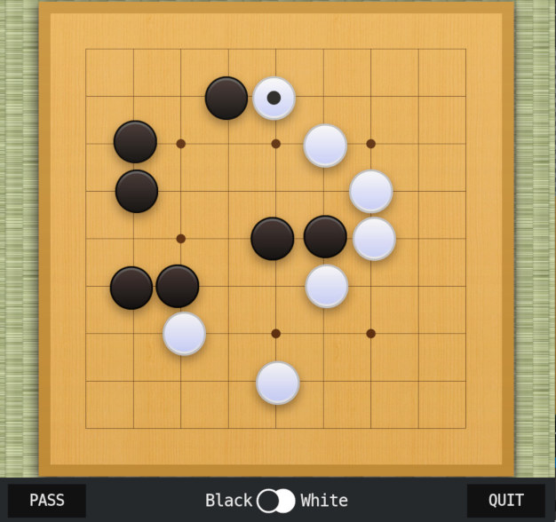

# BUGOUT

🐛Play Go against your friends,   _over the web!_ 🕸



## Design

- Powered by [Sabaki](https://sabaki.yichuanshen.de/) and [kafka](https://kafka.apache.org/)
- Uses a [fork of Sabaki](https://github.com/Terkwood/Sabaki) for the web UI
- A [public-facing websocket gateway](gateway/README.md) communicates with the browser
- [Kotlin & Kafka streams adjudicates games](judge/README.md), [announces moves](changelog/README.md), [provides game lobby functionality](game-lobby/README.md), and [implements fair color choice for the players](color-chooser/README.md).
- [A microservice to provide game history on request](history-provider/README.md)

## Data Flow

Judge emits move data to `bugout-move-accepted-ev`, which is an input to changelog.  Changelog emits moves to `bugout-move-made-ev` after recording them.  Gateway listens to `bugout-move-made-ev`.

## Running in Amazon Web Services

This system is being slowly migrated to a [relatively cost-efficient design](https://github.com/Terkwood/BUGOUT/issues/75) with initial support for Amazon Web Services.

You need to set `KAFKA_INTERNAL_IP` on the host which runs the kafka container, e.g.

```sh
export KAFKA_INTERNAL_IP=ip-NNN-NN-N-NNN.ec2.internal
docker-compose -f dc-giant.yml up
```

This will allow the gateway instance to connect to kafka.

Importantly, don't forget to allow traffic between instances within the security group!

## Resources

- [Kotlin + Kafka streams](https://blog.ippon.tech/kafka-tutorial-6-kafka-streams-in-kotlin/)
- [Kafka streams quickstart](https://kafka.apache.org/22/documentation/streams/quickstart)
