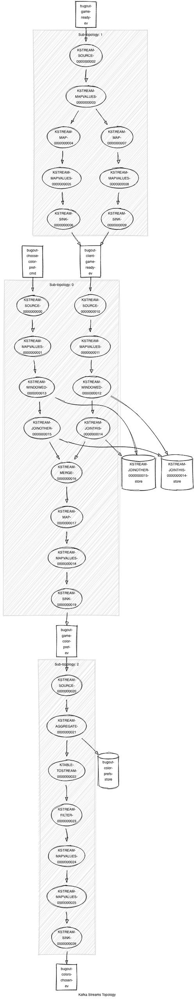

# Color Chooser

This kafka stream service allows players to choose a `Color Pref`: `Black`, `White`, or `Any`. It resolves conflicts in a fair manner, when they arrive:  for example, if both players prefer `Black`, the service randomly assigns one of the two players to use `White`.

## API and Domain Model

The service is triggered whenever a `Game Ready` event is annouced, _and_ when both players issues `Choose Color Pref` commands.  The service emits a `Colors Chosen` event once fair placement is resolved.

## Topology

