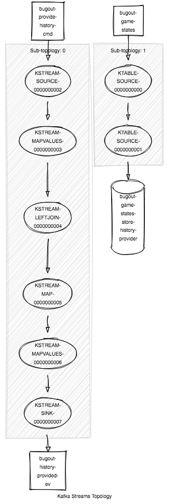

# History Provider

This microservice provides the game history when requested.  [It prevents white from missing the first turn](https://github.com/Terkwood/BUGOUT/issues/64).

## Mechanism

The gateway must request the history for a given `game_id` via the `bugout-provide-game-history-cmd` channel:

To make a request for a game's history, send a `ProvideHistoryCommand` to `bugout-provide-history-cmd` topic using the game ID as the message key:

```sh
echo '507e5048-7f0a-4fb0-9270-689010fa2461:{"gameId":"507e5048-7f0a-4fb0-9270-689010fa2461", "reqId": "1b51f374-c970-4008-ad42-6c5e2206a127"}' | kafkacat -b kafka:9092 -t bugout-provide-history-cmd -K: -P
```

You will receive a history of the game's moves in a `HistoryProvided` event:

```text
HistoryProvided(gameId=507e5048-7f0a-4fb0-9270-689010fa2461, replyTo=1b51f374-c970-4008-ad42-6c5e2206a127, eventId=0167a888-e9b4-4c14-8d60-18806d7f590b, history=History(gameId=507e5048-7f0a-4fb0-9270-689010fa2461, moves=[Move(player=BLACK, coord=Coord(x=4, y=5), turn=1)]), epochMillis=1565375620374)
```

## Streams Topology


