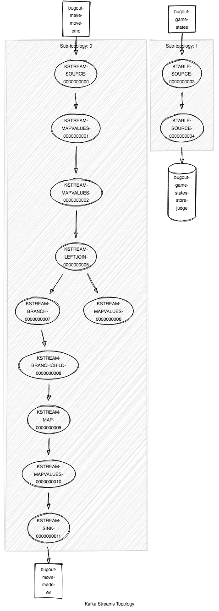

# Kafka streams topologies

This is an example of the data flow used to judge individual moves:

You can view topologies for the various services:

- [color-chooser](color-chooser/topology.jpg)
- [game-lobby](game-lobby/topo.jpg)
- [history-provider](history-provider/topo.jpg)

## Resources

- [Kotlin + Kafka streams](https://blog.ippon.tech/kafka-tutorial-6-kafka-streams-in-kotlin/)
- [Kafka streams quickstart](https://kafka.apache.org/22/documentation/streams/quickstart)
